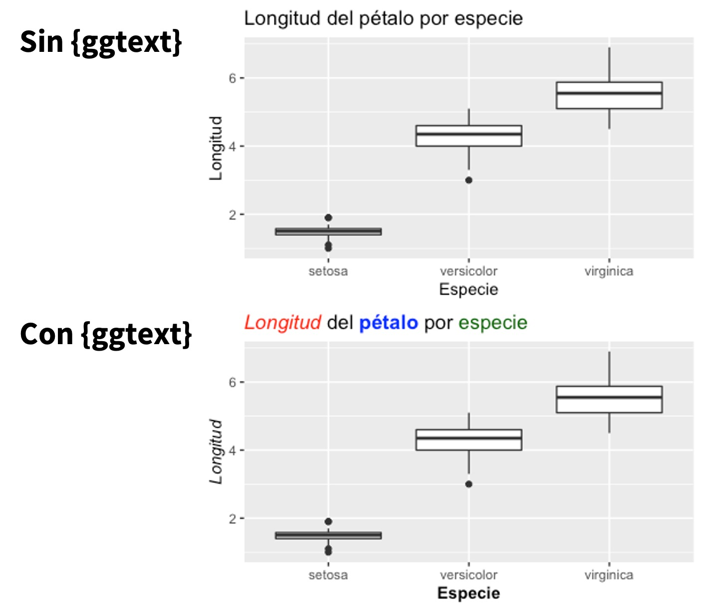
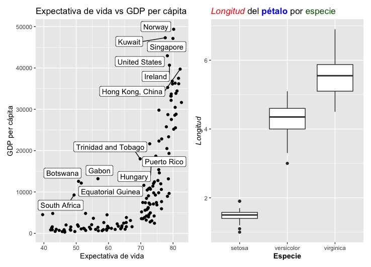

Hace algunos meses decidí participar en el [#30DayChartChallenge](https://github.com/camartinezbu/30DayChartChallenge2022), un desafío propuesto por [Dominic Royé](https://dominicroye.github.io/en/#about) y [Cédric Scherer](https://www.cedricscherer.com/top/about/) que consistía en realizar un gráfico durante cada día de Abril con una temática específica. 

Aunque no logré completar los 30 días, durante este desafío pude potenciar mis conocimientos en ggplot2, y de paso, conocí varios paquetes que permiten extender la funcionalidad de este maravilloso paquete para crear gráficos aún más interesantes.

En este blog quiero compartir contigo 4 paquetes que me utilicé y que espero que te gusten. Encontrarás los enlaces a la documentación de los paquetes al final del post.

## 1. ggtext

ggtext es un paquete que aumenta las posibilidades para dar formato a textos en ggplot2, al incluir funcionalidades propias de Markdown y HTML. La funcionalidad que más utilicé durante el desafío fue definir colores y estilos para palabras específicas, cosa que no se puede hacer usando la función `theme()`. Por ejemplo:


*Figura 1. Ejemplo ggtext.*

Para ello, debes usar también el paquete `glue()`, incluir un par de etiquetas de HTML a tu texto normal y definir el texto que modificaste como un `element_markdown()` en la función `theme()`.

```r
library(ggtext)
library(glue)

# Gráfico básico
ggplot(iris, aes(x=Petal.Length, y = Petal.Width)) +
  geom_point() +
  labs(
    title = "Longitud vs Ancho de pétalo",
    x = "Longitud",
    y = "Ancho"
  )

# Gráfico con ggtext
ggplot(iris, aes(x=Petal.Length, y = Petal.Width)) +
  geom_point() +
  labs(
    title = glue("<i style='color:\"red\"'>Longitud</i> vs
                       <b style='color:\"blue\"'>ancho</b> del
                       <b style='color:\"darkgreen\"'>pétalo</b>"),
    x = glue("**Longitud**"),
    y = glue("*Ancho*")
  ) +
  theme(
    plot.title = element_markdown(),
    axis.title.x = element_markdown(),
    axis.title.y = element_markdown()
  )
```

> En la versión más reciente de R (4.2.0), ggtext tiene problemas para mostrar los textos en negrilla y cursiva. Si encuentras este problema, instala la versión más reciente de gridtext con el comando `remotes::install_github("wilkelab/gridtext")`

## 2. ggrepel

¿Te ha pasado que intentas poner etiquetas en un gráfico pero aparecen demasiadas y muy cerca unas de otras? Este paquete también se centra en el trabajo con textos y mejora la ubicación de las etiquetas en el gráfico, al definir una fuerza que las *repele* entre si.


*Figura 2. Ejemplo ggrepel.*

Como se puede ver, ggrepel automáticamante oculta las etiquetas que estén muy cerca, de acuerdo con los parámetros asociados a la fuerza descrita y otdena las etiquetas restantes de tal manera que no se sobrelapen entre si. Lo único que se necesita es reemplazar la función `geom_label()` por `geom_label_repel()`. Este paquete también permite cambiar `geom_text()` por `geom_text_repel()`.

El código para generar estos gráficos es el siguiente:

```r
library(ggrepel)
library(gapminder)

gapminder_2007 <- gapminder %>%
  filter(year == 2007)

# Gráfico básico
ggplot(gapminder_2007 ,aes(lifeExp, gdpPercap, label = country)) +
  geom_point() +
  geom_label() +
  labs(
    title = "Expectativa de vida vs GDP per cápita",
    x = "Expectativa de vida",
    y = "GDP per cápita"
  )

# Gráfico con ggrepel
ggplot(gapminder_2007 ,aes(lifeExp, gdpPercap, label = country)) +
  geom_point() +
  geom_label_repel() +
  labs(
    title = "Expectativa de vida vs GDP per cápita",
    x = "Expectativa de vida",
    y = "GDP per cápita"
  )

```

## 3. patchwork

Si bien ggplot2 tiene herramientas poderosas para modificar granularmente cada uno de los componentes de un gráfico, no es tan fácil generar una salida que contenga múltiples gráficos a la vez. Especialmente cuando quieres ir más allá de las funciones `facet_grid()` o `facet_wrap()`.

El paquete patchwork entra a llenar este vacío y te permite unir cuantos gráficos quieras, en la distribución que quieras. Sólo basta guardar cada uno de los gráficos en un objeto distinto, y luego con una sintaxis sencilla ordenarlos en el lienzo. A continuación algunos ejemplos:

```r
grafico_ggrepel + grafico_ggtext
```

*Figura 3. patchwork: izquierda y derecha.*

```r
grafico_ggrepel / grafico_ggtext
```


*Figura 4. patchwork: arriba y abajo.*

```r
grafico_ggrepel / (grafico_ggtext | grid::textGrob('Este es un texto muy importante'))
```


*Figura 5. patchwork: formas más complejas.*

## 4. gganimate

Usualmente pensamos en los gráficos de ggplot2 como elementos estáticos, y le dejamos visualizaciones más interesantes a herramientas como [plotly](https://plotly.com) o [d3.js](https://d3js.org). Sin embargo, muchas personas no saben que podemos generar animaciones y gifs a través del paquete gganimate, tal como si estuvieramos trabajando con facetas.

La explicación de cómo funciona gganimate amerita su propia entrada de blog. Por ahora, para mostrar este paquete en todo su esplendor, te comparto un gráfico que hice para el desafío con la evolución de la pirámide poblacional en Colombia desde 1950.


*Figura 6. Animación de la pirámide poblacional en Colombia.*

El código con el que generé este gráfico lo puedes encontrar [acá](https://github.com/camartinezbu/30DayChartChallenge2022/blob/main/22-animation/scripts/1-plot.R).

## Conclusión

Es hora de subir el nivel de los gráficos que haces con ggplot2. Te invito que integres estos paquetes en tu flujo de trabajo normal en ggplot2 y que explores sus funcionalidades. La documentación de los paquetes la podrás encontrar en los siguientes links:

- [ggtext](https://wilkelab.org/ggtext/)
- [ggrepel](https://ggrepel.slowkow.com)
- [patchwork](https://patchwork.data-imaginist.com)
- [gganimate](https://gganimate.com)

Recuerda compartir este post si te pareció interesante y si tienes alguna pregunta que me quieras hacer, dejarla en los comentarios.
