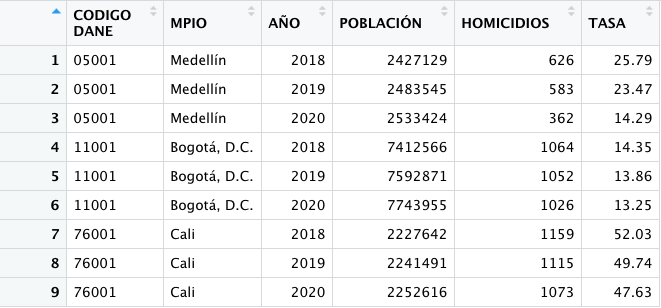
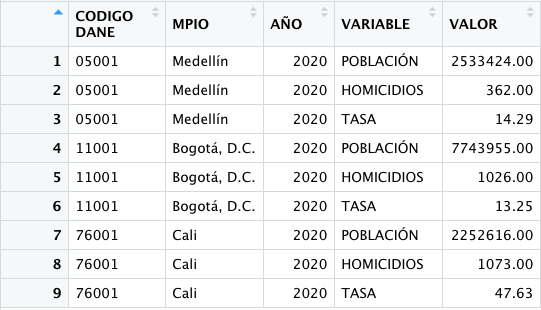
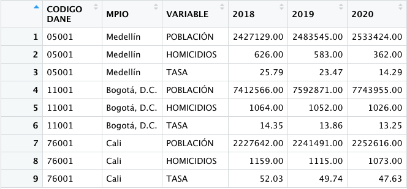

Hay numerosas formas en las que podemos encontrar los datos para realizar nuestros análisis. No sólo me refiero a lo que tiene que ver con formatos - no siempre vamos a encontrar únicamente archivos .xlsx -, sino también a la organización misma de los datos en una tabla. Justo por esto, la limpieza y organización de los datos es una de las actividades más importantes en la Ciencia de Datos. Hoy les quiero hablar del concepto de Tidy data, cómo y cuándo aplicarlo en tu flujo de trabajo.

## Una claridad

Para empezar, tenemos que partir de la base de que vamos a hablar de datos tabulares, es decir, que se distribuyen en **filas** y **columnas**. Puede parecer exagerado hacer esta claridad, después de todo estamos familiarizados con herramientas como Micosoft Excel o Google Sheets, que claramente cumplen estas características. 

Sin embargo, también existen diversas formas de almacenar datos que no necesariamente cumplen esta condición. Algunos ejemplos son los datos en formatos `XML` o `JSON`.

## ¿Tidy data?

Sin haberlo dicho explícitamente, seguro ya tienes una intuición de qué tipos de información se guardan en una base de datos. Lo que almacenamos es un conjunto de **valores**: pueden ser datos numericos o categóricos, que corresponden a una **variable** y una **observacion**. 

Una variable contiene todas las mediciones de un mismo atributo (por ejemplo la estatura de todas las personas que estudian en un salón de clases) y una observación contiene todos los atributos medidos para la misma unidad (edad, estatura, sexo, etc. para la misma persona). 

El **Tidy data** tiene que ver justamente con estos conceptos. Es un conjunto de principios cuyo propósito es estandarizar la manera en que se mapea la información contenida en las bases de datos con su estructura. Es decir, conseguir tablas en las que se pueda identificar fácilmente cuales son las observaciones, las variables y los valores, lo que a su vez facilitará su análisis en un lenguaje de programación.
 
## Los principios del Tidy data

De acuerdo con el [paper de Hadley Wickham](https://vita.had.co.nz/papers/tidy-data.pdf) una base de datos está ordenada (Tidy) o desordenada (Messy) dependiendo de si las filas, columnas y tablas corresponden con observaciones, variables y tipos. Sin entrar en detalles , esto tiene una explicación en las reglas de normalización para las bases de datos relacionales como SQL. Para efectos prácticos, en una base de datos ordenada:

1. Cada variable forma una columna.
2. Cada observación forma una fila.
3. Cada unidad observacional es una tabla.

Para los siguientes ejemplos, voy a usar la información del número de homicidios en 3 ciudades de Colombia, de acuerdo con la información descargada del [Sistema de Información Estadístico, Delincuencial, Contravencional y Operativo de la Policía Nacional](https://www.policia.gov.co/grupo-informaci%C3%B3n-criminalidad/estadistica-delictiva), junto con las proyecciones de población del DANE con base en el [Censo de 2018](https://www.dane.gov.co/index.php/estadisticas-por-tema/demografia-y-poblacion/proyecciones-de-poblacion).

*Tabla 1: Una tabla que cumple con los principios de Tidy Data*

Como puedes ver, la tabla anterior obedece a los principios del Tidy data. Cada observación - Bogotá, Medellín y Cali - está en una fila, cada variable - el año, la población, los homicidios y la tasa por 100.000 habitantes - está en su propia columna, y sólo tenemos una tabla porque sólo tenemos una unidad observacional - las ciudades -.

## Algunos ejemplos comunes de datos desordenados

Si las bases de datos ordenadas son las que cumplen con estos principios, las bases de datos desordenadas son las que incumplen al menos uno de ellos. A continuación vamos a ver los tipos más comunes de datos desordenados, que obedecen al incumplimiento de los principios 1 y 2 del Tidy data.

### Los nombres de las columnas son valores y no variables

En este ejemplo, seleccioné únicamente la variable de Homicidios de la tabla. Como puedes ver, en vez de tener una columna con el año y una columna para homicidios, los nombres de las columnas contienen los años observados. De esta manera, hay 3 columnas que se refieren a la misma variable: Homicidios.

*Tabla 2: Los nombres de las columnas son valores y no variables*

### Varias variables están almacenadas en una columna

Para este caso, filtré la tabla para incluir únicamente las observaciones del año 2020. Al mirar la tabla se evidencia que las variables de Población, Homicidios y Tasa de homicidios se encuentran en una única columna llamdada Homicidios. Fïjate cómo se perjudica la legibilidad de la tabla al hacer este cambio.

*Tabla 1: Varias variables estan almacenadas en una columna*

### Las variables están almacenadas tanto en columnas como filas

Finalmente, este ejemplo mezcla los dos casos anteriores. Por un lado, los valores de la variable año son los títulos de las columnas y por el otro, las variables de población, homicidios y tasa están en una misma columna.

*Tabla 4: Las variables están almacenadas tanto en columnas como en filas*

## ¿Siempre debo usar el tidy data?

Es importante decir que esta no necesariamente es la manera "correcta" de almacenar los datos en una tabla. Probablemente las tablas que vayas a incluir en un reporte o en una presentación no cumplan con estos requisitos y esto no está mal per se. No en todas las ocasiones queremos que exista esta correspondencia entre los elementos y la estuctura de las tablas. Simplemente, los principios del Tidy data son útiles para efectos del análisis de datos y la programación.

A modo de ejemplo, ya sabemos que la tabla 1 cumple con estos principios: las variables están en las columnas y las observaciones en las filas. Sin embargo, también es cierto que la tabla 2 es un poco más fácil de leer si quisieramos ver la evolución de los homicidios por ciudad en los últimos 3 años. Si bien el Tidy data es una herramienta importante para tu trabajo con datos, no necesariamete es una navaja suiza que sirva en todos los contextos.

En todo caso, tener una manera estándar de almacenamiento de datos que tenga claras cuales son las observaciones, variables y valores, te puede ayudar a optimizar el flujo de trabajo y crear funciones para limpiar y procesar datos. No hay nada mejor que tener ya la función lista para el análisis de una base de datos que no habías trabajo antes.

## Bonus: ¿Y en Código?

A modo de acompañamiento a este post, y para que conozcas algunas de las funciones útiles para organizar las bases de datos según lo visto anteriormente, escribí un script de R y un script de Python para pasar de la Tabla 1 a las tablas de los ejemplos de bases de datos desordenadas y viceversa. Puedes acceder a los scripts y al archivo `.csv` en el [siguiente link](https://github.com/camartinezbu/blog-examples/tree/main/2021-02-14-que-significa-que-los-datos-esten-ordenados).

Espero que te haya inspirado conocer este concepto. Te invito a revisar el trabajo de Hadley Wickham, sobre el que me basé para escribir este post y que puedes encontrar en [este link](https://vita.had.co.nz/papers/tidy-data.pdf). Es una lectura corta pero amena, que te ayudará a profundizar sobre las aplicaciones del Tidy Data.
